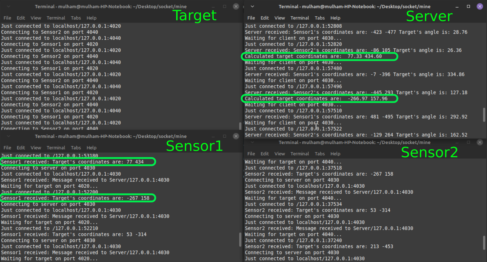

# Java Client-Server TCP communication
In the Repository I made an example, where we have a 2D space (1000 x 1000) and 2 sensors and one randomly put target on that space. the flow of the program is as the following:

You can compile each script by running:

        javac file.java

And then execute it by running:

        java file

Start the program by running the server first, then the sensors 1 and 2, and then the target.

The Target will generate new instance with new location every 5 seconds, and the program will continue working forever. you can stop the target by pressing ctrl+C in the terminal, the other scripts then will timeout and stop automatically.

The following screenshot is the output of the files:

